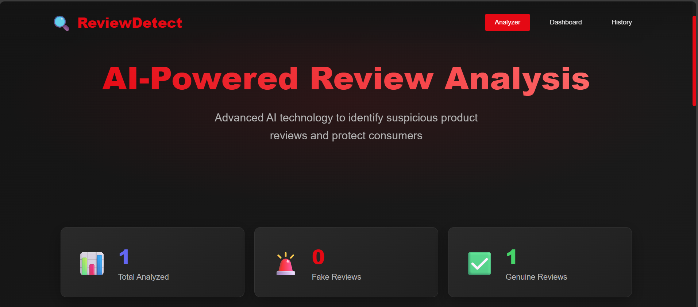

## How to Run the Backend (Flask)
1. Open a terminal and navigate to the `backend` folder:
  ```sh
  cd backend
  ```
2. Install dependencies:
  ```sh
  pip install -r requirements.txt
  ```
3. Start the Flask server:
  ```sh
  python app.py
  ```
  The API will run at `http://127.0.0.1:5000`.

## How to Run the Frontend (React)
1. Open a terminal and navigate to the `frontend` folder:
  ```sh
  cd frontend
  ```
2. Install dependencies:
  ```sh
  npm install
  ```
3. Start the React app:
  ```sh
  npm start
  ```
  The dashboard will run at `http://localhost:3000`.

## How to Use
- Open the React dashboard in your browser.
- Enter a product review and submit to analyze if it is fake or genuine.
- View recent analyzed reviews and dashboard statistics.

## Training the Model
- Use the provided Jupyter notebook to preprocess data and train a model.
- Save the trained model (e.g., as `model.pkl`) and update the Flask backend to use it for predictions.

## Pushing to GitHub
1. Add all files:
  ```sh
  git add .
  ```
2. Commit:
  ```sh
  git commit -m "Add working code and resources"
  ```
3. Push:
  ```sh
  git push -u origin main
  ```

## Notes
- For production, use a proper WSGI server for Flask and build the React app.
- Add a `.gitignore` to exclude unnecessary files (e.g., `node_modules`, `.env`).
# Fake-Reviews-Detection

## Problem Statement

Detection of fake reviews out of a massive collection of reviews having various distinct categories like Home and Office, Sports, etc. with each review having a corresponding rating, label i.e. CG(Computer Generated Review) and OR(Original Review generated by humans) and the review text.

Main task is to detect whether a given review is fraudulent or not. If it is computer generated, it is considered fake otherwise not.

## Description

 Description: The generated fake reviews dataset, containing 20k fake reviews and 20k real product reviews. OR = Original reviews (presumably human created and authentic); CG = Computer-generated fake reviews. 
 
## Python Libraries and Packages Used
 
 <ul>
  <li>Numpy</li>
  <li>Pandas</li>
  <li>Matplotlib.pyplot</li>
  <li>Seaborn</li>
  <li>Warnings</li>
  <li>nltk</li>
  <li>nltk.corpus</li>
  <li>String</li>
  <li>sklearn.naive_bayes</li>
  <li>sklearn.feature_extraction</li>
  <li>sklearn.model_selection</li>
  <li>sklearn.ensemble</li>
  <li>sklearn.tree</li>
  <li>sklearn.linear_model</li>
  <li>sklearn.svc</li>
  <li>sklearn.neighbors</li>
</ul>

## Techniques Used for Text Preprocessing

<ul>
  <li>Removing punctuation character</li>
  <li>Transforming text to lower case</li>
  <li>Eliminating stopwords</li>
  <li>Stemming</li>
  <li>Lemmatizing</li>
  <li>Removing digits</li>
</ul>

## Transformers Used for Text Vectorization, Weighting and Normalization

<ul>
  <li>CountVectorizer Bag of Words Transformer</li>
  <li>TFIDF(Term Frequency-Inverse Document Frequency) Transformer</li>
</ul>

## Machine Learning Algorithms Used

<ol>
  <li>Logistic Regression</li>
  <li>K Nearest Neighbors</li>
  <li>Support Vector Classifier</li>
  <li>Decision Tree Classifier</li>
  <li>Random Forests Classifier</li>
  <li>Multinomial Naive Bayes</li>
</ol>

## Performance Overview of ML Models Leveraged

<p>Support Vector Machines Classifier performed the most accurate predictions regarding the fake nature of reviews having a predictive accuracy of just over 88%, closely followed by Logistic Regression which had a prediction accuracy of a little more than 86%. Random Forests Classifier and Multinomial Naive Bayes algorithm predicted to a precision level of approximately 84%. However, the Decision Tree Classifier performed fake reviews prediction upto an accuracy of just over 73%. The worst performing algorithm was the K Nearest Neighbors algorithm which could only perform the predictions upto an accuracy level of nearly 58%.</p>

## Demo Screenshot



## Prediction Output


## License
 
 CC-By Attribution 4.0 International
 
